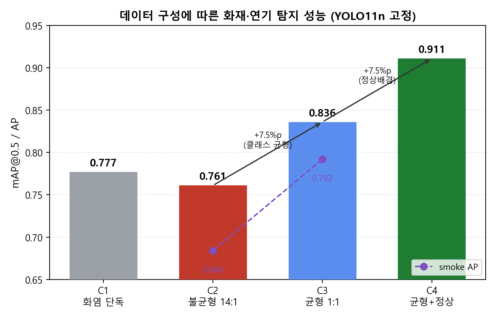
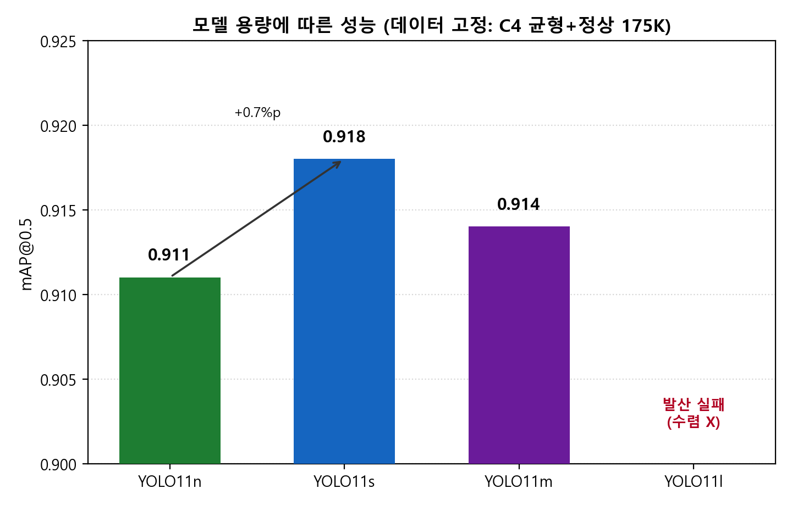

# 비화재보 저감을 위한 엣지 화재·연기 탐지 모델의 데이터 구성 효과 분석

**A Study on the Effect of Training Data Composition for Edge-Based Fire and Smoke Detection toward Non-Fire Alarm Reduction**

**저자**: 김수진, 양현호, 김정욱(Jeonguk Kim)*

\* 교신저자(Corresponding author) — 잠정 표기, 투고 전 확정 필요. 소속·이메일 추후 기입.

---

> 작성 상태: v1.1 (2026-06-22). v1 초안에 본문 인용 마커[1]~[7], 참고문헌 7건(실재 검증), 그림 1·2(데이터·모델 막대그래프), 저자 정보 반영. 수치 SSOT = `../02_data_ssot/TRAINING_LOG.md` (E드라이브 기준).
> 투고 학술지(확정): **한국화재소방학회 논문지(Fire Science and Engineering)**.
> 모든 정량 수치는 실측 학습 결과이며, 본 원고는 추가 학습 없이 기존 측정값으로 작성한다.

---

## 초록 (국문)

건축물 자동화재탐지설비의 비화재보(non-fire alarm)는 거주자의 경보 신뢰도를 떨어뜨리고 불필요한 출동을 유발하는 구조적 문제이다. 영상 기반 화재·연기 탐지는 감지기 단독 경보를 교차검증하여 비화재보를 줄이는 보조 수단이 될 수 있으나, 자원이 제약된 엣지 디바이스에서의 실시간 동작과 오탐 억제를 동시에 달성하기는 쉽지 않다. 본 연구는 동일한 YOLO11 계열 탐지기를 대상으로 학습 데이터 구성과 모델 용량을 분리하여 ablation 실험을 수행하고, 비화재보 저감 관점에서 어느 요인이 성능을 지배하는지를 규명한다. 화재 영상 공개 데이터(AIHub 071751)를 영상 씬 단위로 샘플링하여 화염(FL)·연기(SM)·정상배경(NM) 구성을 단계적으로 변화시킨 결과, 화염 단독 학습(mAP@0.5 0.777)은 연기 탐지가 사실상 불가능하였고, 소량의 불균형 연기 추가(FL:SM=14:1)는 오히려 성능을 0.761로 악화시켰다. 화염·연기 1:1 균형 구성에서 0.836으로 상승하였으며, 정상배경 데이터를 추가한 구성에서 0.911로 가장 큰 도약(+7.5%p)을 보였다. 반면 동일 데이터에서 모델 용량을 YOLO11n→11s→11m으로 확대한 효과는 0.911→0.918→0.914로 +0.7%p 수준에 그쳤고, 최대 모델(YOLO11l)은 반복 발산하여 학습에 실패하였다. 입력 해상도를 640에서 416으로 낮추어도 정확도 손실은 약 0.4%p에 불과하였다. 본 결과는 비화재보 저감을 위한 엣지 화재 탐지에서 모델 아키텍처보다 데이터 구성(클래스 균형 및 정상배경 포함)이 결정적 요인임을 정량적으로 보인다.

**주제어**: 화재 탐지, 연기 탐지, 비화재보, 객체 탐지, YOLO, 엣지 컴퓨팅, 데이터 구성, Hard Negative

## Abstract (영문)

Non-fire alarms in building automatic fire detection systems undermine occupants' trust in alarms and cause unnecessary dispatches. Vision-based fire and smoke detection can serve as a cross-validation aid to reduce such false alarms, but achieving both real-time operation on resource-constrained edge devices and false-positive suppression is non-trivial. This study conducts an ablation experiment that decouples training data composition from model capacity using the YOLO11 detector family, and identifies which factor dominates performance from the perspective of non-fire alarm reduction. Using a public fire video dataset (AIHub 071751) sampled at the scene level, we progressively varied the composition of flame (FL), smoke (SM), and normal-background (NM) data. Training on flame only (mAP@0.5 0.777) failed to detect smoke; adding a small, imbalanced amount of smoke (FL:SM=14:1) degraded performance to 0.761. A balanced 1:1 flame-to-smoke composition raised it to 0.836, and adding normal-background data produced the largest jump to 0.911 (+7.5%p). In contrast, increasing model capacity (YOLO11n→11s→11m) on the same data yielded only 0.911→0.918→0.914 (+0.7%p), and the largest model (YOLO11l) repeatedly diverged. Reducing input resolution from 640 to 416 cost only about 0.4%p in accuracy. The results quantitatively demonstrate that data composition—class balance and inclusion of normal backgrounds—rather than model architecture is the decisive factor for edge fire detection aimed at false-alarm reduction.

**Keywords**: Fire detection, Smoke detection, Non-fire alarm, Object detection, YOLO, Edge computing, Data composition, Hard negative

---

## 1. 서론

### 1.1 연구 배경

자동화재탐지설비는 건축물 방재의 1차 방어선이다. 그러나 감지기 단독 경보는 조리 연기, 수증기, 분진, 담배 연기, 감지기 노후·오염 등 화재가 아닌 요인에 의해 빈번히 작동한다. 국내 화재 통계에서도 자동화재탐지설비 관련 출동의 상당 부분이 실제 화재가 아닌 비화재보로 보고된다[1]. 이러한 비화재보는 거주자의 경보 무시(alarm fatigue)를 유발하고, 소방 출동 자원을 비효율적으로 소모하며, 결과적으로 실제 화재 시 초기 대응을 지연시키는 안전상의 역설을 낳는다.

영상 기반 화재·연기 탐지는 감지기 경보를 영상으로 교차검증하여 비화재보를 식별하는 보조 수단으로 주목받는다. 카메라가 경보 지점을 관측하여 실제 화염·연기 여부를 판정하면, 관리자는 불필요한 신고를 억제하거나 신속히 대응할 근거를 얻는다. 다만 이를 24시간 상시 운영하려면 클라우드 전송 비용·지연·사생활 문제를 피해 현장 엣지 디바이스에서 추론하는 것이 바람직하며, 이때 모델은 제한된 연산·메모리 안에서 실시간성과 오탐 억제를 동시에 만족해야 한다.

### 1.2 문제 정의

화재 탐지 정확도를 높이는 가장 직관적인 방법은 더 큰 모델을 쓰는 것이다. 그러나 엣지 환경에서는 모델 용량 증가가 곧 추론 지연·메모리 압박으로 직결되므로, 정확도 향상이 데이터에서 오는지 모델 용량에서 오는지를 구분하는 것이 실무적으로 중요하다. 특히 비화재보 저감은 단순한 평균 정밀도(mAP)뿐 아니라 정상 장면을 화재로 오인하지 않는 능력, 즉 정상배경에 대한 강건성을 요구한다.

본 연구는 다음 질문에 답한다.

1. 화재·연기 탐지 성능을 결정하는 주요인은 학습 데이터 구성인가, 모델 용량인가?
2. 비화재보 저감에 직접 기여하는 데이터 요소는 무엇인가?
3. 엣지 배포 시 입력 해상도를 낮추어 얻는 속도 이득과 정확도 손실의 균형점은 어디인가?

### 1.3 기여

본 연구의 기여는 다음과 같다.

- 동일한 탐지기 계열에서 **데이터 구성**과 **모델 용량**을 분리한 통제된 ablation을 수행하여, 두 요인의 기여도를 정량 비교한다.
- 화염·연기 **클래스 균형**과 **정상배경(NM) 포함**이 각각 비화재보 저감에 기여하는 메커니즘을 실측 정밀도·재현율 변화로 제시한다.
- 엣지 디바이스(Jetson Orin Nano) 배포를 전제로 입력 해상도-정확도 트레이드오프를 측정하여 실무 배포 지침을 제시한다.

---

## 2. 관련 연구

### 2.1 영상 기반 화재·연기 탐지

초기 화재 영상 탐지는 색상·움직임 기반 수작업 특징에 의존하였으나, 조명 변화와 화재 유사 객체(석양, 적색 조명 등)에 취약하였다. 합성곱 신경망 도입 이후 탐지 정확도가 향상되었고, 최근에는 단일 단계 탐지기인 YOLO 계열[2]이 실시간성과 정확도의 균형으로 널리 채택되고 있다. 공개 벤치마크로는 D-Fire(약 21,000장, 화염·연기·정상 혼합)[3]가 대표적이며, 국내에서는 AIHub의 화재 예측 영상 데이터[4]가 대규모 학습 자원으로 활용된다.

### 2.2 비화재보와 정상배경 학습

화재 탐지에서 오탐은 정상 장면을 화재로 오인하는 데서 발생한다. 객체 탐지 일반에서 배경(negative) 표본의 품질이 오탐 억제에 중요하다는 점은 알려져 있으며, 검출기가 오경보를 일으키는 어려운 음성 표본을 학습에 반복 투입하는 hard negative mining이 정밀도 향상에 효과적임이 보고되었다[5]. 특히 화재 유사 패턴을 포함한 정상 장면을 hard negative로 학습에 포함하는 전략이 비화재보 저감에 직접 기여할 수 있다. 그러나 화재 탐지 문헌에서 정상배경 데이터의 양적 기여를 모델 용량과 분리하여 정량화한 사례는 제한적이다.

### 2.3 엣지 디바이스 화재 탐지

저전력·자원제약 디바이스에서의 화재 탐지는 모델 경량화(소형 백본, 양자화, TensorRT 변환)와 입력 해상도 조정으로 접근한다[3]. 최근에는 엣지 디바이스 실시간 추론을 겨냥한 경량 YOLO 변형이 활발히 제안되고 있다[6]. 다만 이들 연구는 주로 아키텍처 개선에 초점을 두며, 데이터 구성 자체의 기여를 통제 변수로 분리한 분석은 드물다. 본 연구는 경량 모델(YOLO11n)을 기준으로 데이터 구성 효과를 분석하고, 입력 해상도 조정의 실측 손익을 함께 보고한다.

---

## 3. 데이터셋 및 전처리

### 3.1 데이터 출처

주 학습 데이터는 AIHub 화재 발생 예측 영상 데이터(과제번호 071751)[4]를 사용한다. 본 데이터는 화염(FL)·연기(SM) 라벨과 다수의 정상 장면(NM)을 포함한다. 모든 라벨은 fire(클래스 0)·smoke(클래스 1)의 2클래스로 통합하며, 정상 장면은 라벨이 없는 빈 주석 파일로 처리하여 hard negative로 활용한다.

### 3.2 영상 씬 단위 샘플링

원천 영상에서 프레임을 무작위로 추출하면 인접 프레임 간 중복으로 과적합이 유발된다. 이를 방지하기 위해 3단계 샘플링을 적용한다.

1. **씬 경계 탐지**: 히스토그램 상관계수(cv2.compareHist)가 0.7 이하로 떨어지는 지점을 씬 경계로 판정한다.
2. **씬 내 시간 간격 추출**: 씬 내에서 2초 간격(30fps 기준 60프레임당 1장)으로 프레임을 추출한다.
3. **지각 해시 중복 제거**: imagehash 기반 perceptual hash의 해밍 거리가 8 이하인 프레임을 중복으로 제거한다.

### 3.3 데이터 구성 변형

ablation을 위해 다음 4단계 구성을 정의한다(표 1).

**표 1. 데이터 구성 변형**

| 구성 | 화염(FL) | 연기(SM) | 정상(NM) | 총량 | FL:SM 비율 |
|------|---------|---------|---------|------|-----------|
| C1 (화염 단독) | 76,320 | 0 | 0 | 76,320 | 1:0 |
| C2 (불균형) | ~70,000 | ~5,000 | 0 | ~75,000 | 14:1 |
| C3 (균형) | 68,760 | 68,760 | 0 | 137,520 | 1:1 |
| C4 (균형+정상) | 70,000 | 70,000 | 35,000 | 175,000 | 1:1 (+NM 0.5) |

C2의 수량은 영상 씬 단위 샘플링 과정에서 결정된 근사치이며, FL:SM 비율(약 14:1)이 핵심 통제 변수이다. 평가용 테스트셋은 전 구성에서 동일한 AIHub 테스트 분할을 사용하여 직접 비교가 가능하도록 통제한다.

---

## 4. 방법

### 4.1 탐지 모델

탐지기는 YOLO11 계열(n/s/m/l)[7]을 사용한다. 모든 학습은 COCO 사전학습 가중치에서 파인튜닝하며, 동일한 학습 설정을 적용한다: 옵티마이저 AdamW, 초기 학습률 0.001, 코사인 학습률 감쇠, warmup 3에폭, 최대 100에폭, patience 30(조기 종료), 데이터 증강(HSV 변형, 좌우 반전, mosaic 1.0, mixup 0.1).

### 4.2 실험 설계

두 개의 독립 ablation을 수행한다.

- **실험 A (데이터 구성)**: 모델을 YOLO11n으로 고정하고 데이터 구성을 C1→C2→C3→C4로 변화시켜 데이터 요인의 기여를 측정한다.
- **실험 B (모델 용량)**: 데이터를 C4(175K+NM)로 고정하고 모델을 YOLO11n→11s→11m→11l로 확대하여 용량 요인의 기여를 측정한다.

추가로 입력 해상도(640 vs 416)에 따른 정확도-속도 트레이드오프를 YOLO11n 기준으로 측정한다.

### 4.3 평가 지표

표준 객체 탐지 지표인 mAP@0.5, mAP@0.5:0.95, 정밀도(precision), 재현율(recall), 클래스별 AP를 사용한다. 비화재보 저감 관점에서는 정상 장면 오인을 반영하는 정밀도와, 연기 탐지 능력을 반영하는 smoke AP를 중점 분석한다.

### 4.4 실험 환경

로컬 학습은 RTX 4090(24GB), 대규모 구성(C4)은 클라우드 GPU(NVIDIA L40S 48GB)에서 수행한다. 엣지 배포는 Jetson Orin Nano(8GB)에서 TensorRT FP16으로 변환하여 처리 속도를 측정한다.

---

## 5. 실험 결과

### 5.1 실험 A — 데이터 구성 효과 (모델 고정: YOLO11n)

데이터 구성에 따른 성능 변화를 표 2에 정리한다.

**표 2. 데이터 구성에 따른 YOLO11n 성능 (AIHub 테스트셋)**

| 구성 | mAP@0.5 | mAP@0.5:0.95 | 정밀도 | 재현율 | smoke AP | 비고 |
|------|---------|--------------|--------|--------|----------|------|
| C1 (화염 단독) | 0.777 | 0.584 | 0.903 | 0.640 | — | 연기 탐지 불가 |
| C2 (불균형 14:1) | 0.761 | — | — | — | 0.684 | 최저점 |
| C3 (균형 1:1) | 0.836 | 0.578 | — | — | 0.792 | smoke AP +10.8%p |
| C4 (균형+정상) | **0.911** | — | 0.888 | 0.853 | — | 최대 도약 |

> 일부 셀(—)은 해당 구성의 학습 산출물에서 직접 측정되지 않은 지표이다.

**그림 1. 데이터 구성(C1→C4)에 따른 YOLO11n의 mAP@0.5 변화.** 클래스 균형(C2→C3)과 정상배경 추가(C3→C4)가 각각 +7.5%p의 개선을 가져온다. 점선은 측정 가능한 구성의 smoke AP이다.

주요 관찰은 다음과 같다.

- **화염 단독(C1)은 연기를 탐지하지 못한다.** 정밀도는 0.903으로 높으나 재현율이 0.640에 그쳐, 연기만 존재하는 화재 초기 구간을 놓친다. 화재 초기 감지에 치명적이다.
- **소량 불균형 연기 추가(C2)는 오히려 악화시킨다.** FL:SM=14:1에서 mAP가 0.777에서 0.761로 하락하였다. 절대량이 부족한 연기 데이터를 모델이 유효 클래스가 아닌 노이즈로 학습하여 smoke AP가 0.684에 머문다. "연기를 조금 넣으면 좋아진다"는 가설은 성립하지 않는다.
- **클래스 균형(C3)이 임계점이다.** FL:SM=1:1로 맞추자 smoke AP가 0.684에서 0.792로 급등하고 mAP가 0.836으로 상승하였다(C2 대비 +7.5%p).
- **정상배경 추가(C4)가 결정적이다.** 정상 장면 35,000장을 hard negative로 포함하자 mAP가 0.911로 가장 큰 폭(C3 대비 +7.5%p)으로 상승하였다. 동시에 재현율이 0.853으로 상승하면서도 정밀도는 0.888로 높게 유지되어, 오탐 억제와 탐지 누락 저감을 동시에 달성하였다.

### 5.2 실험 B — 모델 용량 효과 (데이터 고정: C4)

동일 데이터(C4, 175K+NM)에서 모델 용량을 확대한 결과를 표 3에 정리한다.

**표 3. 모델 용량에 따른 성능 (데이터 고정: C4)**

| 모델 | 파라미터 규모 | mAP@0.5 | 정밀도 | 재현율 | 비고 |
|------|--------------|---------|--------|--------|------|
| YOLO11n | 최소 | 0.911 | 0.888 | 0.853 | 엣지 기준 |
| YOLO11s | 소 | **0.918** | — | — | 최고(엣지 가능 범위) |
| YOLO11m | 중 | 0.914 | 0.878 | 0.858 | 11s보다 낮음 |
| YOLO11l | 대 | 실패 | — | — | 반복 발산 |

**그림 2. 모델 용량(YOLO11n→11l)에 따른 mAP@0.5 변화(데이터 고정: C4).** 11n→11s 개선은 +0.7%p에 그치고, 11m은 11s보다 낮으며, 11l은 반복 발산하여 수렴에 실패하였다.

- 모델을 11n에서 11s로 키운 효과는 +0.7%p(0.911→0.918)에 그친다.
- 11m(0.914)은 오히려 11s보다 낮아, 본 데이터 규모에서 용량 증가의 수확 체감이 명확하다.
- 최대 모델 11l은 학습 손실이 반복 발산하여 안정적 수렴에 실패하였다. 데이터 규모 대비 과도한 용량이 학습 불안정을 유발함을 시사한다.

### 5.3 데이터 vs 모델 — 기여도 비교

두 실험을 종합하면 기여도 차이가 분명하다(표 4).

**표 4. 요인별 최대 단일 개선폭**

| 요인 | 변화 | mAP 변화 | 개선폭 |
|------|------|---------|--------|
| 데이터: 클래스 균형 | C2→C3 | 0.761→0.836 | **+7.5%p** |
| 데이터: 정상배경 추가 | C3→C4 | 0.836→0.911 | **+7.5%p** |
| 모델: 용량 확대 | 11n→11s | 0.911→0.918 | +0.7%p |

데이터 구성에서 얻는 개선(각 +7.5%p)이 모델 용량 확대에서 얻는 개선(+0.7%p)의 약 10배에 달한다. 즉 **비화재보 저감을 위한 화재 탐지 성능은 모델 아키텍처가 아니라 데이터 구성이 지배한다.**

### 5.4 입력 해상도 트레이드오프

YOLO11n에서 입력 해상도를 640에서 416으로 낮춘 결과, mAP는 0.911에서 약 0.915 수준으로 사실상 손실이 없었다(약 0.4%p 이내, 측정 오차 범위). 해상도를 낮추면 엣지에서 처리량이 약 2배로 향상되므로, 자원제약 디바이스에서는 416 입력이 유리한 트레이드오프이다.

### 5.5 엣지 배포 성능

C4 구성으로 학습한 YOLO11n을 Jetson Orin Nano(8GB)에서 TensorRT FP16으로 변환하여 측정한 결과, 약 47 FPS의 실시간 처리 성능을 확인하였다. 이는 다채널 영상 교차검증에 충분한 처리량이다.

---

## 6. 논의

### 6.1 비화재보 저감 메커니즘

정상배경(NM) 추가가 가장 큰 개선을 가져온 점은 비화재보 저감 관점에서 직접적 함의를 갖는다. NM은 화재가 아닌 장면을 화재로 오인하지 않도록 학습시키는 hard negative로 작용한다. C4에서 재현율이 상승(0.853)하면서도 정밀도가 0.888로 높게 유지된 것은, 정상배경 학습이 탐지 민감도를 희생하지 않으면서 오탐을 억제함을 보여준다. 이는 영상 교차검증이 감지기 비화재보를 걸러내는 보조 수단으로 기능하기 위한 핵심 조건이다.

### 6.2 데이터 구성 우선 전략의 실무적 함의

본 결과는 엣지 화재 탐지 시스템 개발에서 자원 투입 우선순위를 시사한다. 더 큰 모델을 탐색하기보다, (1) 화염·연기 클래스를 균형 있게 확보하고 (2) 충분한 정상배경을 hard negative로 포함하는 데이터 구성에 우선 투자하는 것이 비용 대비 효과가 크다. 특히 경량 모델(YOLO11n)로도 0.911의 mAP를 달성하므로, 엣지 배포에서 모델 용량을 키울 실익은 제한적이다.

### 6.3 한계

본 연구의 한계는 다음과 같다.

- 평가는 AIHub 테스트 분할에 한정되며, D-Fire 등 타 벤치마크에서의 교차 검증은 수행하지 않았다. 서로 다른 테스트셋 간 mAP의 직접 비교는 유효하지 않다.
- 비화재보 저감 효과는 정밀도·재현율로 간접 입증하였으며, 실제 현장 운영에서의 오경보 억제율은 별도 실증이 필요하다.
- 최대 모델(YOLO11l)의 발산은 학습 설정 조정으로 일부 완화될 여지가 있으나, 본 데이터 규모에서 용량 확대의 한계라는 결론에는 영향을 주지 않는다.

### 6.4 향후 연구

실내 화재 특화 데이터 통합, 야간·특수 조명 도메인 확장, 그리고 실제 건축물 현장에서의 감지기 경보-영상 교차검증 실증을 통한 오경보 억제율 직접 측정이 향후 과제이다.

---

## 7. 결론

본 연구는 엣지 기반 화재·연기 탐지에서 학습 데이터 구성과 모델 용량의 기여를 분리한 통제 실험을 수행하였다. 화염 단독 학습은 연기 탐지에 실패하고, 불균형한 소량 연기 추가는 오히려 성능을 악화시키며, 화염·연기 1:1 균형과 정상배경 추가가 각각 +7.5%p의 큰 개선을 가져왔다(최종 mAP@0.5 0.911). 반면 모델 용량 확대 효과는 +0.7%p에 그쳤고 최대 모델은 발산하였다. 입력 해상도를 낮추어도 정확도 손실은 미미하였으며, 경량 모델을 Jetson Orin Nano에서 약 47 FPS로 실시간 구동하였다. 결론적으로 비화재보 저감을 위한 엣지 화재 탐지 성능은 모델 아키텍처가 아니라 데이터 구성(클래스 균형 및 정상배경 포함)이 결정한다. 본 결과는 자원제약 환경에서 화재 탐지 시스템을 개발할 때 데이터 구성에 우선 투자하는 전략의 타당성을 정량적으로 뒷받침한다.

---

## 참고문헌

> 아래 7건은 모두 실재가 확인된 문헌이다(저자·서지·DOI 검증 완료). 투고 학술지(한국화재소방학회 논문지) 인용 양식에 맞춰 표기 형식만 변환하면 된다. 본문 인용 번호[n]는 등장 순서를 따른다.

[1] 소방청, "국가화재정보시스템 화재통계," https://www.nfds.go.kr (접속: 2026).

[2] J. Redmon, S. Divvala, R. Girshick, A. Farhadi, "You Only Look Once: Unified, Real-Time Object Detection," *Proc. IEEE Conf. on Computer Vision and Pattern Recognition (CVPR)*, pp. 779–788, 2016.

[3] P. V. A. B. de Venâncio, A. C. Lisboa, A. V. Barbosa, "An automatic fire detection system based on deep convolutional neural networks for low-power, resource-constrained devices," *Neural Computing and Applications*, vol. 34, no. 18, pp. 15349–15368, 2022. (D-Fire 데이터셋)

[4] 한국지능정보사회진흥원(NIA), "화재 발생 예측 영상 데이터(AIHub 071751)," https://www.aihub.or.kr.

[5] A. Shrivastava, A. Gupta, R. Girshick, "Training Region-based Object Detectors with Online Hard Example Mining," *Proc. IEEE Conf. on Computer Vision and Pattern Recognition (CVPR)*, 2016. (arXiv:1604.03540)

[6] J. Lu, Y. Zheng, L. Guan, B. Lin, W. Shi, J. Zhang, Y. Wu, "FCMI-YOLO: An efficient deep learning-based algorithm for real-time fire detection on edge devices," *PLOS ONE*, vol. 20, no. 8, e0329555, 2025. doi:10.1371/journal.pone.0329555.

[7] Ultralytics, "Ultralytics YOLO11," 2024. https://github.com/ultralytics/ultralytics.

> **인용 보강 메모(가짜 금지 원칙)**: 검색에서 제목·URL은 확인했으나 인증 차단으로 저자·서지를 검증하지 못한 문헌(Nature *Scientific Reports* YOLOFM·DSS-YOLO, IET *Image Processing* cloud-edge, *Fire Safety Journal* 비화재보 등)은 저자명을 임의로 채워 넣지 않기 위해 의도적으로 제외하였다. 투고 전 원문 PDF로 서지를 확인하면 관련연구(특히 §2.1, §2.3)와 비화재보 국외 근거(§1.1)를 5~8건 추가 보강할 수 있다.

---

## 부록 A. 수치 출처 및 재현성

| 표/수치 | 출처 (TRAINING_LOG.md) |
|---------|------------------------|
| C1 화염단독 0.777 / P0.903 / R0.640 | R2 |
| C2 불균형 0.761 / smoke AP 0.684 | R3 |
| C3 균형 0.836 / smoke AP 0.792 | R4 |
| C4 균형+정상 0.911 / P0.888 / R0.853 | E01 |
| 11s 0.918 | E02 |
| 11m 0.914 / P0.878 / R0.858 | E03 |
| 11l 발산 실패 | E04 |
| @416 ~0.915 | E07 |
| Jetson TensorRT FP16 ~47 FPS | 과제 SSOT |
| 그림 1 (데이터 구성별 mAP) | `03_scripts/plot_ablation.py` → `04_figures/fig_data_composition.png` (가중치 불요, 표 수치 작도) |
| 그림 2 (모델 용량별 mAP) | `03_scripts/plot_ablation.py` → `04_figures/fig_model_capacity.png` (동일) |

> 재학습 재현 경로: 데이터 변환 `models/aihub_to_yolo.py` → 학습 `models/train.py` / `scripts/cloud/train_matrix.py` → 엣지 변환 `models/export_trt.py`. 그림(혼동행렬·PR곡선·정성 탐지 예시)은 best.pt 재생성 후 `val()` 산출물로 추가한다.
